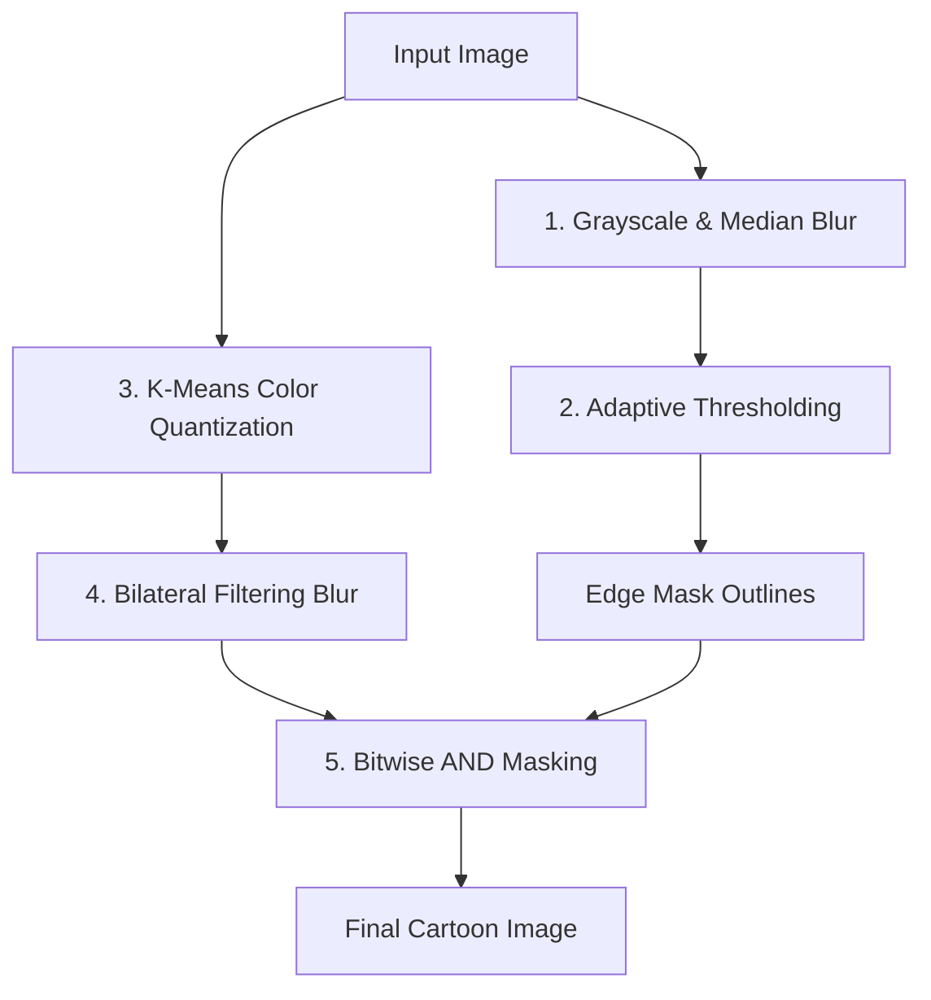

# Image Cartoonization with OpenCV

An interactive and optimized Computer Vision pipeline built in Python using OpenCV to transform standard real-world photographs into stylized cartoon drawings. This project showcases advanced image processing techniques including edge detection, adaptive thresholding, K-Means clustering color quantization, and bilateral noise filtering.

---

## 🚀 Key Features

* **Adaptive Edge Masking:** Uses grayscale conversion, median blur, and adaptive thresholding to generate clean, bold outlines resembling hand-drawn sketches.
* **K-Means Color Quantization:** Applies unsupervised machine learning (K-Means clustering) to simplify the image's color space and produce a flat, painterly palette.
* **Bilateral Filtering (Detail Smoothing):** Leverages bilateral filters to smooth out flat color regions (blurring noise) while preserving sharp, high-contrast boundaries.
* **Dynamic Image Composition:** Overlays detected outlines back onto the smoothed, quantized color image using bitwise masking to output the final cartoon design.
* **Interactive Jupyter Environment:** Complete, step-by-step modular code cells using Matplotlib to visualize each step of the pipeline.

---

## 🛠️ Technology Stack

* **Language:** Python 3.11+
* **Libraries:** 
  * `OpenCV (cv2)` – For core image processing algorithms (adaptive thresholding, k-means, bilateral filtering)
  * `NumPy` – For array manipulations and vectorizing color clusters
  * `Matplotlib` – For rendering and visualizing intermediate steps within the notebook
* **Environment:** Jupyter Notebook

---

## 📖 Pipeline Overview

The cartoonization effect is achieved through a sequential four-step pipeline:



### 1. Edge Masking
The image is converted to grayscale, and a median filter is applied to remove noise before thresholding. Adaptive thresholding is then used to highlight local contrast boundaries, producing thick, hand-drawn-like black edges.
```python
gray = cv2.cvtColor(img, cv2.COLOR_RGB2GRAY)
gray_blur = cv2.medianBlur(gray, 7)
edges = cv2.adaptiveThreshold(gray_blur, 255, cv2.ADAPTIVE_THRESH_MEAN_C, cv2.THRESH_BINARY, 7, 7)
```

### 2. Color Quantization
To create the flat color fields typical of cartoons, K-Means clustering groups the thousands of pixel colors into a small, distinct set of $K$ colors (e.g., $K=8$ or $K=2$).
```python
data = np.float32(img).reshape((-1, 3))
criteria = (cv2.TERM_CRITERIA_EPS + cv2.TERM_CRITERIA_MAX_ITER, 20, 0.001)
ret, label, center = cv2.kmeans(data, K, None, criteria, 10, cv2.KMEANS_RANDOM_CENTERS)
```

### 3. Bilateral Noise Reduction (Blurring)
A bilateral filter is applied to smooth out details and reduce noise in the quantized color image. Unlike Gaussian blur, it preserves sharp edge boundaries by utilizing both spatial and radiometric similarities.
```python
blurred = cv2.bilateralFilter(img, d=7, sigmaColor=200, sigmaSpace=200)
```

### 4. Merging
Finally, the edge mask and the bilateral-filtered color image are merged using a bitwise AND operation, framing the flat color fields with bold black outlines.
```python
cartoon = cv2.bitwise_and(blurred, blurred, mask=edges)
```

---

## 💻 Installation & Usage

### Prerequisites
Make sure you have Python 3.11+ and virtualenv installed.

1. **Clone the Repository:**
   ```bash
   git clone https://github.com/Sharan-Sanadi/image-cartoonization-opencv.git
   cd image-cartoonization-opencv
   ```

2. **Set Up a Virtual Environment:**
   ```bash
   python -m venv .venv
   # Activate on Windows:
   .venv\Scripts\activate
   # Activate on macOS/Linux:
   source .venv/bin/activate
   ```

3. **Install Dependencies:**
   ```bash
   pip install opencv-python numpy matplotlib jupyter
   ```

4. **Launch the Notebook:**
   ```bash
   jupyter notebook notebook.ipynb
   ```

---

## 👤 Author

* **Sharan Sanadi**
* GitHub: [@Sharan-Sanadi](https://github.com/Sharan-Sanadi)
